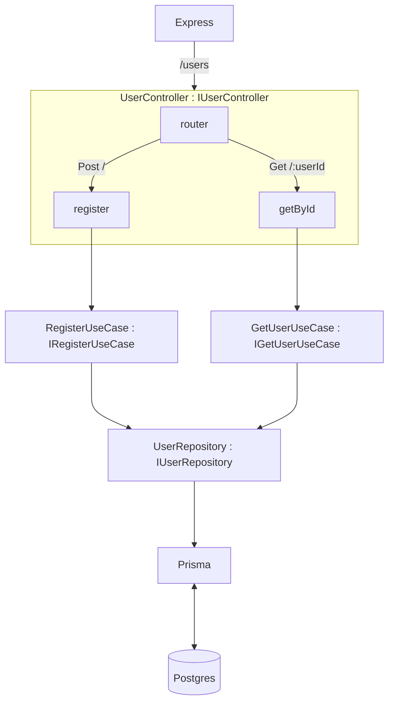

# Blog Express Typescript API

## About this project

This project is blog contents application API using TDD and clean architecture.

## Dependencies

### Language

- Typescript with node

### Package Manager

- pnpm

### Framework

- express.js

### Database

- postgresql

### ORM

- prisma

### Validator

- express-validator

### Dependency Injection

- inversify
- reflect-metadata

### Linter

- eslint
- prettier

### Test

- jest
- supertest

### Container

- docker
- docker compose

## Service

### Auth

